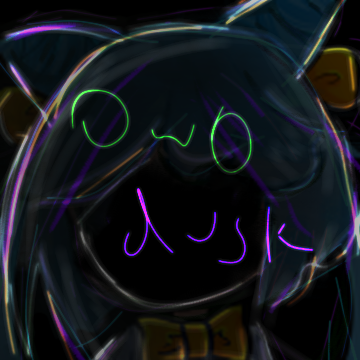
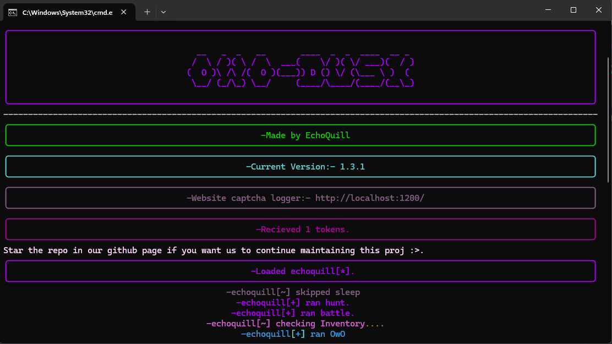
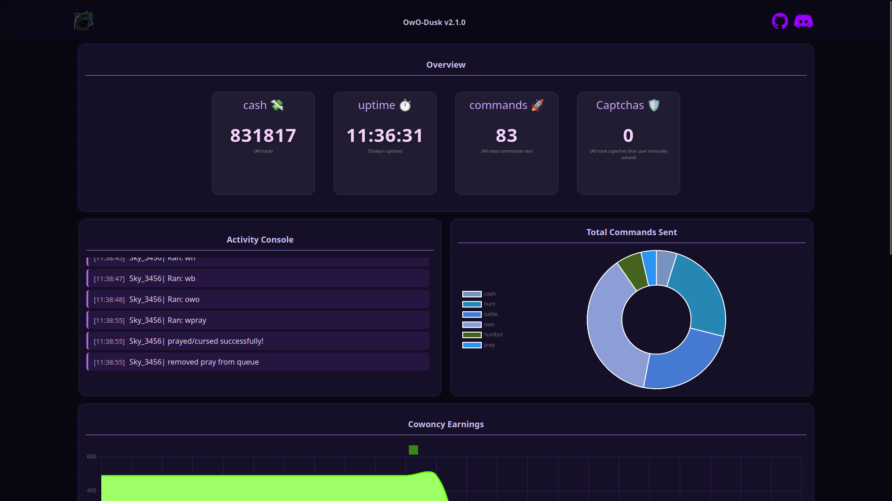

# OwO Dusk

<div align="center">
  
  <br><br>
  <a href="https://git.io/typing-svg">
    
  </a>
  <br><br>
  
  [](https://discord.gg/gUdQQtukMQ)
  [](LICENSE)
  [](https://www.python.org/downloads/)
  
  **A powerful automation tool supporting both mobile and desktop platforms**
  
  [🚀 Quick Start](#installation) • [📖 Documentation](#usage) • [💬 Support](#support) • [🤝 Contributing](#contributing)
</div>

---

## ⚠️ Disclaimer

> **Important Warning**
> 
> This tool involves automation that may violate Discord's Terms of Service and OwO Bot's rules. We are **NOT responsible** if you get banned while using this software. Use at your own risk.
>
> **Recommended Safety Measures:**
> - Use only 1-2 accounts per server
> - Only use in private servers
> - Don't openly share that you use automation
> - Use clean alt accounts that haven't used OwO Bot before

## ✨ Features

- 🖥️ **Cross-Platform Support** - Works on Windows, macOS, Linux, and Android (Termux)
- 📱 **Mobile & Desktop UI** - Responsive interface for all devices
- 🔔 **Captcha Notifications** - Smart captcha detection and alerts
- 🤖 **Reaction Bot Support** - Automated reaction handling
- 🌐 **Web Dashboard** - Browser-based captcha solving interface
- ⚡ **High Performance** - Optimized for speed and reliability

## 📋 Requirements

- **Python 3.8+**
- **Git**
- **Internet Connection**
- **Discord Account** (clean alt recommended)

### Additional Requirements for Android (Termux)
- Termux app
- Termux:API app

## 🚀 Installation

### 💻 Desktop/Laptop (Windows, macOS, Linux)

```bash
# Clone the repository
git clone https://github.com/echoquill/owo-dusk.git

# Navigate to the project directory
cd owo-dusk

# Run setup
python setup.py

# Start the application
python uwu.py
```

> **Note:** Ensure Git and Python are installed. Open terminal in `Desktop` for easier access.

### 📱 Android (Termux)

```bash
# Install dependencies and clone repository
pkg update && pkg upgrade -y && termux-setup-storage && pkg install python git termux-api -y

# Navigate and clone
cd storage/downloads && git clone https://github.com/echoquill/owo-dusk.git

# Setup and run
cd owo-dusk && python setup.py && python uwu.py
```

**For subsequent runs:**
```bash
cd storage/downloads/owo-dusk && python uwu.py
```

> **Requirements:** Install Termux and Termux:API from [F-Droid](https://f-droid.org/) or GitHub releases.

## 🎯 Usage

1. **First Run:** Execute `python setup.py` and follow the configuration prompts
2. **Regular Use:** Run `python uwu.py` to start the bot
3. **Web Dashboard:** Access the browser interface for captcha solving
4. **Mobile Support:** Full functionality available on mobile devices through Termux

## 📸 Screenshots

<div align="center">
  
### Desktop CLI Interface


### Web Dashboard


</div>

## 💬 Support

Need help? We're here to assist you!

- 🔗 **Discord Server:** [Join our community](https://discord.gg/hDDrKhWPqr)
- 👤 **Direct Contact:** Send a friend request to `@echoquill` on Discord
- 📚 **Documentation:** Check our [Wiki](../../wiki) for detailed guides

> **Important:** When joining our Discord, please use a **clean alt account** that hasn't used OwO Bot!

## 🛠️ Development

<div align="center">
  
</div>

### Contributing

We welcome contributions! Please feel free to:
- 🐛 Report bugs
- 💡 Suggest features  
- 🔧 Submit pull requests
- 📝 Improve documentation

## 🙏 Credits & Acknowledgments

This project was inspired by and learned from several amazing projects:

- **[Dank Memer Grinder](https://github.com/BridgeSenseDev/Dank-Memer-Grinder)** - Inspired the cogs architecture and code structure. This project was instrumental in learning Python!
- **[Slashy](https://github.com/TahaGorme/slashy)** & **[Trixiacute](https://github.com/Trixiacute/)** - Inspired the website dashboard design. Much of the JavaScript foundation was adapted from Slashy (with permission).

## 📄 License

This project is licensed under the [MIT License](LICENSE) - see the LICENSE file for details.

## ⭐ Show Your Support

If this project helped you, please consider:
- ⭐ Starring the repository
- 🍴 Forking the project
- 🐛 Reporting issues
- 💖 Sharing with others

---

<div align="center">
  <sub>Built with ❤️ by the OwO Dusk community</sub>
  <br>
  <sub>Thank you for using our tool! We hope it serves you well. 💜</sub>
</div>
