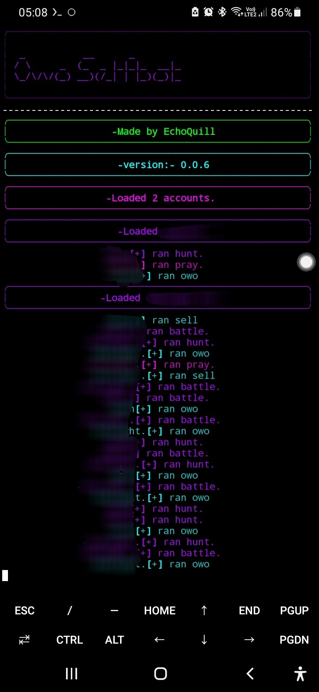
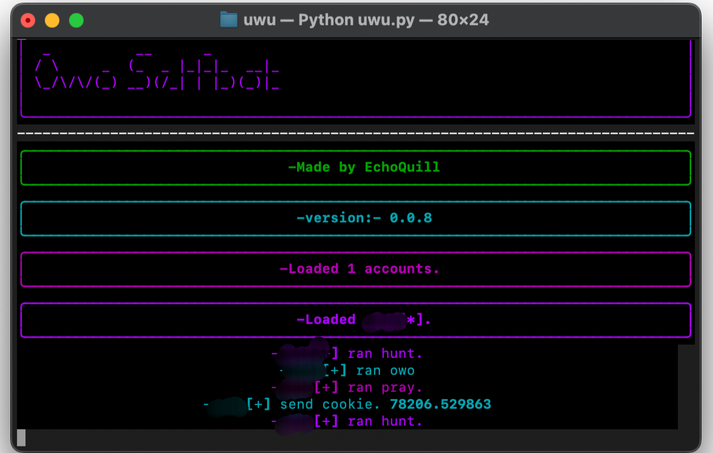
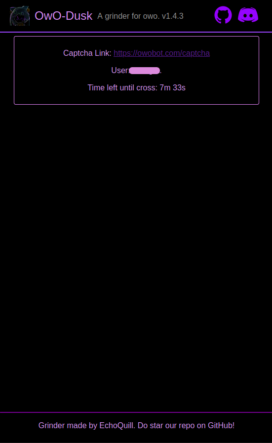

  

   
  <a href="https://git.io/typing-svg">
   
  
   
  
join our discord! (Join with an **CLEAN** alt please , one that hasn't and won't use owobot!)

---

Supports BOTH MOBILE AND DESKTOP with captcha Notifiers for both. And we also support reaction bot, and have a custom dashboard for solving captchas (image ones) through your browser!

> [!IMPORTANT]
> ⚠️🚨 WE ARE NOT responsible if you get banned using our selfbots. Selfbots are agains discord tos and also breaks owo bots rules. If you do plan on using it still then atleast take some steps to ensure that you won't be getting banned like no more than one/two account grinding in one servers, Only grinding in pricate servers, And not openly sharing the fact that you use selfbot to grind owo.
---

> For help with setup, please join our discord server and I'll help you set it up on both termux(android) and desktop/laptop devices. Ill make tutoriales for it laters!

---
# 🌟 Features
---
* Multi-Account Support!!
* Supports reaction bot cooldowns (enable through the config).
* Supports both mobile and desktop/laptop!
* Cool website for solving captchas in one place [allows solving of image captchas there] (localhost) with a 10-minute timer!
* Customizable sleep system.
* Optional reaction bot cooldown support, making OwO-dusk more human-like.
* Auto hunt.
* Auto battle.
* Auto pray.
* Auto curse.
* Auto OwO top.
* Auto daily.
* Auto lottery.
* Automate shop purchases (buying rings, etc.).
* Automatically join OwO giveaways.
* Captcha detection (not a solver!). (restarts automaticall after user manually solves captcha!)
* Level grind.
* Ban detection.
* Auto cookie.
* Auto slots.
* Auto coinflip.
* ~~Auto blackjack~~ [in progress].
* Custom commands: add commands not currently listed with your own cooldowns. :>
* Battery check.
* Auto quest.
* Auto sell/sacrifice.
* Auto buy items (rings, etc. from `owo shop`).
* Auto use crate.
* Auto use lootbox.
* Auto use gems (hunt gem, empowered gem, lucky gem, and special gem).
* OwO lag check.
* OwO-dusk provides many ways to customize captcha notifiers to make sure you don't miss any!
* Automatically accept rules and create battle teams if the user doesn't have one.

---
# Screenshots 📸 
---

  

   
  
Mobile CLI screenshot

   
  

   
  
Desktop CLI screenshot

   
  

   
  
Website for captcha logger.

---
thanks for reading :>, I hope this tool could help you even if a little ❤ .
