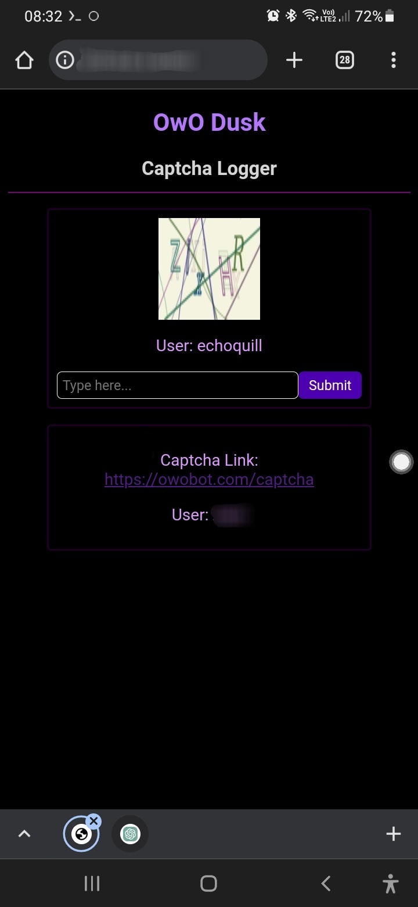

  

   
  <a href="https://git.io/typing-svg">
   
  <a href="https://discord.gg/hDDrKhWPqr">
   
  
join our discord!

---

Supports BOTH MOBILE AND DESKTOP with captcha Notifs for both. And we also support reaction bot, and have a custom dashboard for solving captchas (image ones) through your browser!

> [!IMPORTANT]
> ⚠️🚨 WE ARE NOT responsible if you get banned using our selfbots. Selfbots are agains discord tos and also breaks owo bots rules. If you do plan on using it still then atleast take some steps to ensure that you won't be getting banned like no more than one/two account grinding in one servers, Only grinding in pricate servers, And not openly sharing the fact that you use selfbot to grind owo.
---

> For help with setup, please join our discord server and I'll help you set it up on both termux(android) and desktop/laptop devices.(we are still not done with tutorials, thats why we are helping users in server instead while we finish tutorials)

---
# 🌟 Features
---
* Multi Account Support!!
* Supports reaction bot cooldowns (enable it through config)
* Supports Both mobile and desktop/laptop!
* Cool website for solving captchas in one place (localhost one)
* Customizable sleep system.
* auto hunt
* auto battle
* auto pray
* auto curse
* auto owo top
* auto daily
* auto lottery
* automate shop buying
* automatically join OwO giveaways
* captcha detection (not solver!!)
* ban detection
* auto cookie
* auto slots
* auto coinflip
* ~~auto blackjack~~ [under progress]
* custom commands, you can add commands that is not currently in the list with your own cooldown :>
* battery check
* auto quest
* auto sell/sacrifice
* auto buy items (rings etc, from `owo shop`)
* auto use crate
* auto use lootbox
* auto use Gems (hunt gem, empowered gem, lucky gem and special gem)
* Has owo lag check
* supports both desktop and termux notifications.
* Mobile texttospeech captcha alert
* Sends toasts when captcha {Mobile only}
* level grind.
* automatically accept rules, create battle teams if user doesn't have one.

---
# Screenshots 📸 
---

  

   
  
Mobile CLI screenshot

   
  

   
  
Desktop CLI screenshot

   
  

   
  
Website for captcha logger.

---
thanks for reading :>, I hope this tool could help you even if a little ❤ .
